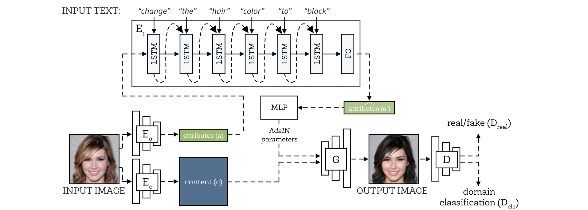

## DWC-GAN

Describe What to Change: A Text-guided Unsupervised Image-to-Image Translation Approach, to appear in ACM International Conference on Multimedia(**ACM MM**), 2020. [[arXiv]](https://arxiv.org/abs/2008.04200)|[[code]](https://github.com/yhlleo/DWC-GAN)




### Configuration

See the [`environment.yaml`](./environment.yaml). We provide an user-friendly configuring method via Conda system, and you can create a new Conda environment using the command:

```
conda env create -f environment.yaml
```

### CelebA faces

 - Official homepage of dataset: [link](http://mmlab.ie.cuhk.edu.hk/projects/CelebA.html) 
 - Prepare the dataset as the bellow structure:

```
datasets
  |__celeba
       |__images
       |    |__xxx.jpg
       |    |__...
       |__list_attr_celeba.txt
```

### Training & Testing

 - Train:

```
sh ./scripts/train_celeba_faces.sh <gpu_id> 0
```

### References

If our project is useful for you, please cite our papers:

```
@inproceedings{liu2020describe,
  title={Describe What to Change: A Text-guided Unsupervised Image-to-Image Translation Approach},
  author={Liu, Yahui and De Nadai, Marco and Cai, Deng and Li, Huayang and Alameda-Pineda, Xavier and Sebe, Nicu and Lepri, Bruno},
  booktitle={Proceedings of the 28th ACM International Conference on Multimedia},
  year={2020}
}
```